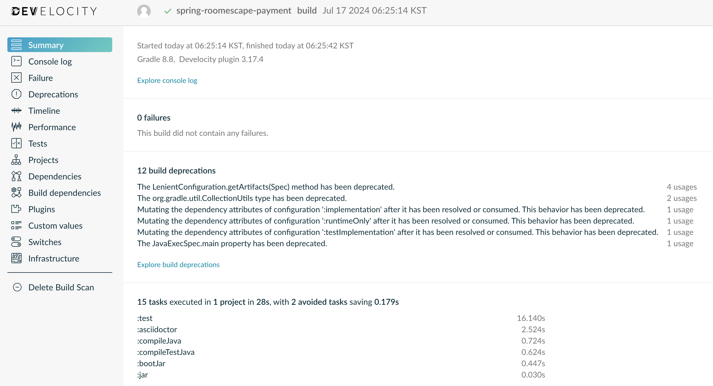

# gradle-demo

우아한테크코스 [테코톡](https://www.youtube.com/) 발표에서 활용한 Gradle 샘플 코드입니다.

## 목차

- [1. build scan](#1-build-scan)
- [2. task configuration avoidance API](#2-task-configuration-avoidance-api)
    - [2.1. create custom task](#21-create-custom-task)
    - [2.2. acquire task reference](#22-acquire-task-reference)
- [3. controlling task execution](#3-controlling-task-execution)
    - [3.1. strong relationship](#31-strong-relationship)
    - [3.2. weak relationship](#32-weak-relationship)
- [4. skip task](#4-skip-task)
- [5. test](#5-test)
    - [5.1. test in parallel](#51-test-in-parallel)
    - [5.2. disable test report](#52-disable-test-report)
    - [5.3. fork test](#53-fork-test)
    - [5.4. test filtering](#54-test-filtering)
- [6. gradle wrapper](#6-gradle-wrapper)
- [7. spring rest docs](#7-spring-rest-docs)

### 1. build scan

```shell
$ ./gradlew build --scan
```

명령어를 실행하면 빌드 스캔 URL이 출력됩니다. 해당 URL을 클릭하면 아래와 같은 빌드 스캔 결과를 확인할 수 있습니다.
<div>
    
</div>

CI 도구와 통합할 경우 [settings.gradle](./task/develocity/settings.gradle)에 코드를 추가합니다.
예시로 사용한 CI 도구는 [github actions](./.github/workflows/buildscan.yml)입니다.

### 2. task configuration avoidance API

연관 관계가 없는 task를 실행할 때 다른 task의 불필요한 구성을 회피하는 방법입니다.

#### 2.1. create custom task

custom task를 생성할 때 `Task`가 아닌 `TaskProvider`를 리턴하는 `TaskContainer.register()` api를 사용하여 구성을 회피합니다.

[build.gradle](./task/lazy/creation/build.gradle)

#### 2.2. acquire task reference

task의 참조를 획득할 때 DSL 블럭을 사용하면 즉시 생성되므로 `TaskProvider`를 리턴하는 `TaskCollection.named()` api를 사용하여 구성을 회피합니다.

[build.gradle](./task/lazy/acquirement/build.gradle)

### 3. controlling task execution

#### 3.1. strong relationship

`dependsOn()`, `finalizedBy()`를 사용하여 task간 의존성을 설정합니다.

[build.gradle](./task/relationship/strong/build.gradle)

#### 3.2. weak relationship

`mustRunAfter()`, `shouldRunAfter()`를 사용하여 task간 실행 순서를 제어합니다.

[build.gradle](./task/relationship/weak/build.gradle)

### 4. skip task

`onlyIf()` 메서드를 사용하여 특정 조건을 만족할 때만 task를 실행합니다.

[build.gradle](./task/skip/build.gradle)

### 5. test

#### 5.1. test in parallel

`maxParallelForks`를 사용하면 속성 값 만큼 CPU 코어를 사용하여 병렬 테스트를 실행합니다.

- 각 테스트는 독립적이어야 합니다.
- 값이 CPU 코어 개수보다 작거나 같아야 합니다.
- 병목이 있는 테스트가 존재할 경우 성능이 비슷할 수 있습니다.

[build.gradle](./task/test/parallel/build.gradle)

#### 5.2. disable test report

test report 생성을 비활성화합니다.

[build.gradle](./task/test/report/build.gradle)

#### 5.3. fork test

Gradle은 모든 테스트를 단일 fork된 vm에서 실행하지만, `forkEvery`를 사용하면 속성 값 만큼 테스트를 실행하고 새로운 프로세스를 fork하여 이어서 진행합니다.
OOM(Out Of Memory)이 발생했을 때 heap 크기를 늘리는 것은 최대치의 한계가 있으며 heavy GC(Garbage Collection)로 인해 비용이 많이 발생합니다.
fork 방식은 상대적으로 비용이 적기 때문에 적절한 `forkEvery` 값을 설정하여 OOM을 회피할 수 있습니다.
새로운 프로세스(VM)를 fork하는 작업에서 비용이 많이 들기 때문에 너무 작은 값을 설정하면 그만큼 fork가 자주 일어납니다.

[build.gradle](./task/test/fork/build.gradle)

#### 5.4. test filtering

`includeTestsMatching`와 `excludeTestsMatching`을 사용하여 특정 테스트만 실행하거나 제외합니다.

[build.gradle](./task/test/filtering/build.gradle)

본 repository에서는 [parallel test](build.gradle)를 실행할 때 filtering을 적용합니다.

### 6. gradle wrapper

Gradle을 직접 설치하지 않고 사용할 수 있는 이유는 wrapper를 사용하기 때문입니다.

- *gradle/wrapper/gradle-wrapper.jar*

  → gradle 배포판을 다운로드하기 위한 코드가 포함된 jar 파일


- *gradle/wrapper/gradle-wrapper.properties*

  → wrapper의 런타임 동작을 구성할 속성이 포함된 파일 (version 등)


- *gradlew*

  → Linux, MacOS에서 wrapper로 빌드를 실행하기 위한 스크립트 파일


- *gradlew.bat*

  → Windows에서 wrapper로 빌드를 실행하기 위한 스크립트 파일

#### 장점

- gradle을 프로젝트에 포함해서 배포할 수 있다.
- 다양한 실행 환경(IDE 또는 CI 서버)에서 gradle 버전을 표준화할 수 있다.
- 여러 개발자에게 동일한 gradle 버전을 제공할 수 있다.

이러한 이유로 gradle은 build를 실행할 때 wrapper 사용을 권장합니다.

#### wrapper version upgrade

```shell
$ ./gradlew wrapper --gradle-version {specific version} 

# or

$ ./gradlew wrapper --gradle-version latest
```

### 7. spring rest docs

[Spring REST Docs](https://docs.spring.io/spring-restdocs/docs/current/reference/htmlsingle/)를
사용하기 위해 추가한 [build.gradle](./task/restdocs/build.gradle)의 각 구성의 역할을 설명합니다.
